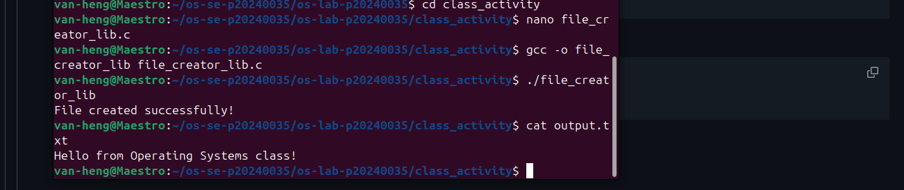
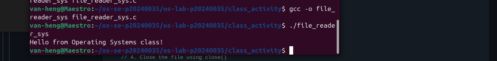
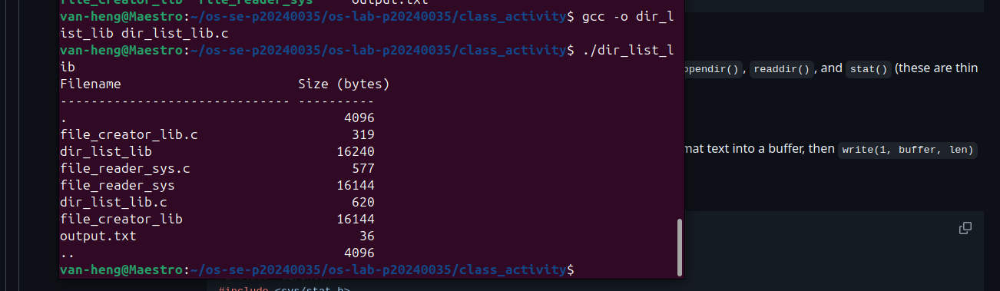
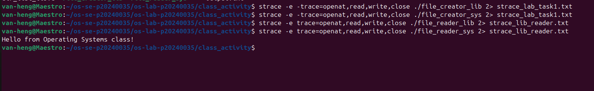
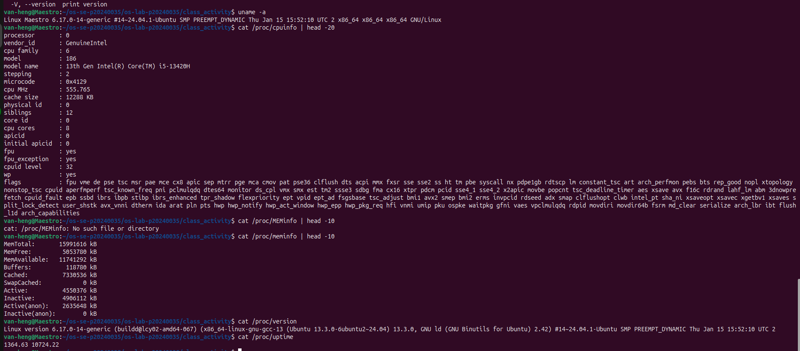
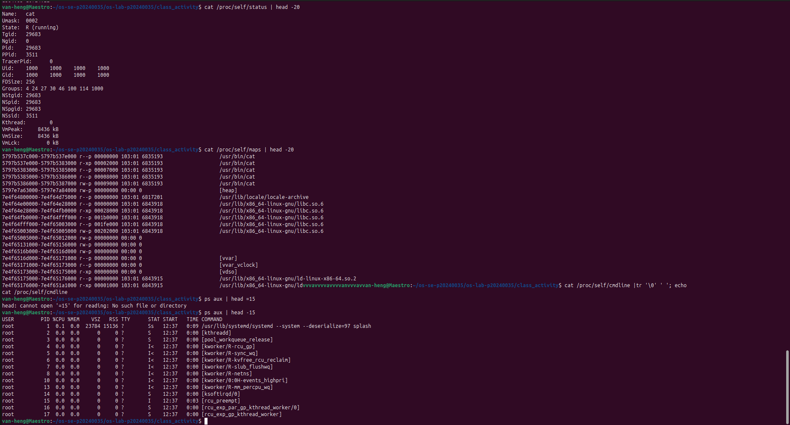
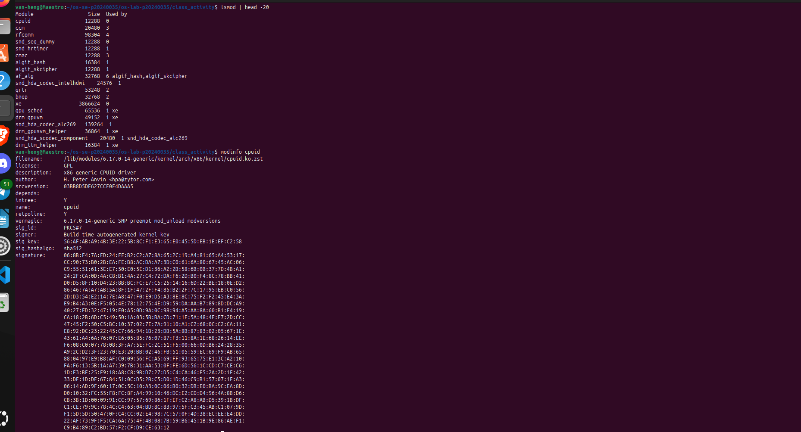
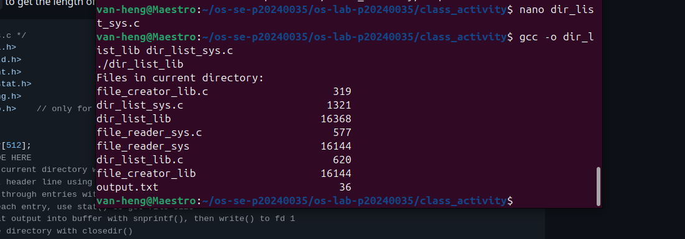

# Class Activity 1 — System Calls in Practice

- **Student Name:** Van Heng
- **Student ID:** p20240035
- **Date:** March 24, 2026

---

## Task 1: File Creator & Reader

### Part A — File Creator

**Describe your implementation:**
The library version is shorter (`fopen`, `fprintf`, `fclose`), while the syscall version is explicit (`open`, `write`, `close`) and requires manual flags and permissions.

**Version A — Library Functions (`file_creator_lib.c`):**

**Version B — POSIX System Calls (`file_creator_sys.c`):**
(Images/task1_partA&B.png)

**Questions:**

1. **What flags did you pass to `open()`? What does each flag mean?**

    > `O_WRONLY | O_CREAT | O_TRUNC`
    > - `O_WRONLY`: write-only mode.
    > - `O_CREAT`: create the file if it does not exist.
    > - `O_TRUNC`: truncate existing file content before writing.

2. **What is `0644`? What does each digit represent?**

    > It is an octal permission mode:
    > - owner: `6` (read + write)
    > - group: `4` (read)
    > - others: `4` (read)

3. **What does `fopen("output.txt", "w")` do internally that you had to do manually?**

    > It wraps low-level open/create/truncate behavior and sets up buffered stdio. With system calls, we manually call `open()`, `write()`, and `close()`.

### Part B — File Reader & Display

**Describe your implementation:**
The syscall reader loops over `read()` and writes each chunk to stdout until EOF.

**Version A — Library Functions (`file_reader_lib.c`):**

_Screenshot currently not available in `Images/`._

**Version B — POSIX System Calls (`file_reader_sys.c`):**

_Screenshot currently not available in `Images/`._

**Questions:**

1. **What does `read()` return? How is this different from `fgets()`?**

    > `read()` returns number of bytes read (`>0`), `0` at EOF, or `-1` on error. `fgets()` returns a string pointer (or `NULL`) and reads line-oriented text.

2. **Why do you need a loop when using `read()`? When does it stop?**

    > One call may not read the entire file. Loop until `read()` returns `0` (EOF) or `-1` (error).

---

## Task 2: Directory Listing & File Info

**Describe your implementation:**
Used `opendir()`, `readdir()`, `stat()`, `snprintf()`, and `write()` to print names and file sizes.

### Version A — Library Functions (`dir_list_lib.c`)

### Version B — System Calls (`dir_list_sys.c`)

### Questions

1. **What struct does `readdir()` return? What fields does it contain?**

    > It returns `struct dirent *`. Common fields: `d_name`, `d_ino`, `d_type`, `d_reclen`, `d_off`.

2. **What information does `stat()` provide beyond file size?**

    > File type/permissions, link count, owner/group, inode/device IDs, and timestamps.

3. **Why can't you `write()` a number directly — why do you need `snprintf()` first?**

    > `write()` outputs raw bytes only. `snprintf()` converts numbers into printable text first.

---

## Task 3: strace Analysis

### strace Output — Library Version (File Creator)

### strace Output — System Call Version (File Creator)

### strace Output — Library Version (Reader/Other)

### Questions

1. **How many system calls does the library version make compared to the system call version?**

    > From `strace -c`: library (`file_creator_lib`) = **38** total calls, syscall-style tested program (`file_reader_sys`) = **34** total calls.

2. **What extra system calls appear in the library version? What do they do?**

    > `mmap`/`mprotect`/`munmap` for memory mappings, `brk` for heap, `access` checks, `fstat` metadata; these are runtime and buffering overhead around core I/O calls.

3. **How many `write()` calls does `fprintf()` actually produce?**

    > In my `strace -c ./file_creator_lib` run: **2 write() calls**.

4. **In your own words, what is the real difference between a library function and a system call?**

    > A system call enters kernel mode directly; a library function runs in user space and may call one or more system calls internally.

---

## Task 4: Exploring OS Structure

### System Information

### Process Information

### OS Layers Diagram

### Questions

1. **What is `/proc`? Is it a real filesystem on disk?**

    > `/proc` is a virtual filesystem generated by the kernel in real time, not normal stored files on disk.

2. **Monolithic kernel vs. microkernel — which type does Linux use?**

    > Linux uses a modular monolithic kernel (evidenced by loaded kernel modules in `lsmod`).

3. **What memory regions do you see in `/proc/self/maps`?**

    > Executable mappings, shared libraries, `[heap]`, and virtual regions like `[vvar]`, `[vvar_vclock]`, `[vdso]`.

4. **Break down the kernel version string from `uname -a`.**

    > It includes kernel family, hostname, kernel release/flavor, build/revision tag, SMP/preemption model, build date, and architecture fields.

5. **How does `/proc` show that the OS is an intermediary between programs and hardware?**

    > Programs read kernel-provided interfaces (`/proc`) rather than hardware directly, showing OS mediation and abstraction.

---

## Reflection

This activity showed that library functions are convenient wrappers, while system calls expose the real kernel boundary and low-level behavior.

