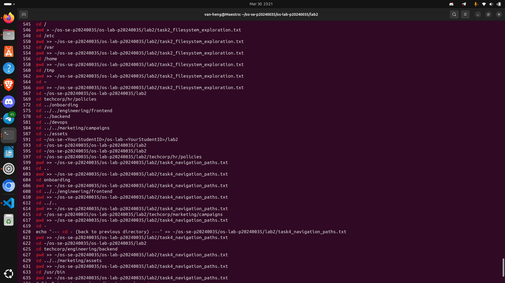
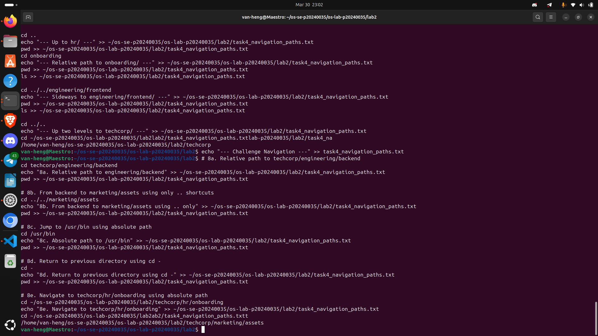
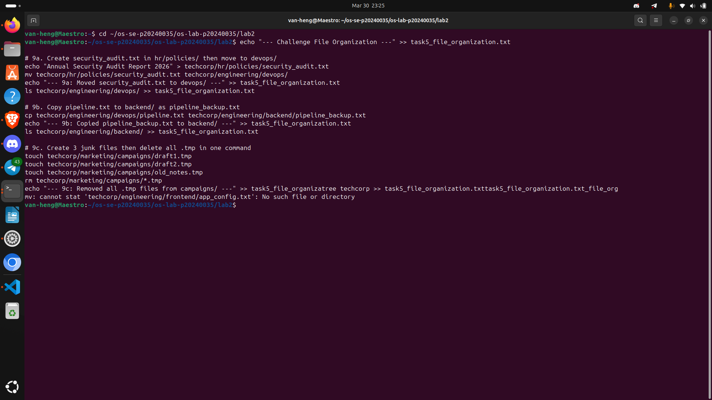
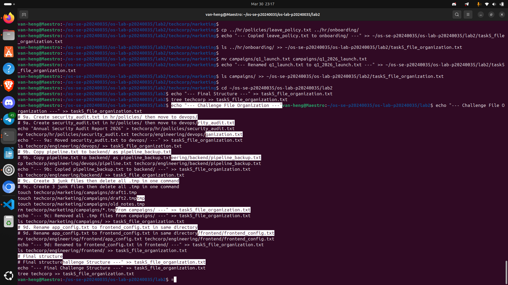
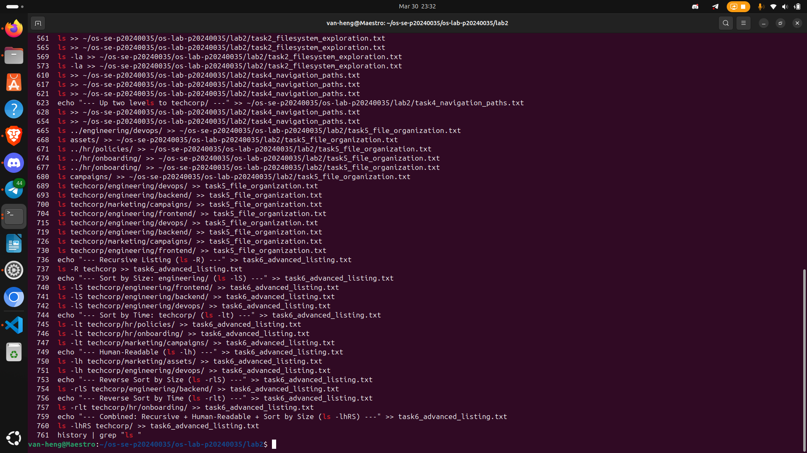

# OS Lab 2 Submission

- Student Name: [Your Name Here]
- Student ID: p20240035

## Task Output Files

During the lab, each task redirected output into text files. These files are included in this folder:

- task1_basic_navigation.txt
- task2_filesystem_exploration.txt
- task3_directory_structure.txt
- task4_navigation_paths.txt
- task5_file_organization.txt
- task6_advanced_listing.txt

## Screenshots

The screenshots below focus on challenge commands and command history.

### Screenshot 1 - Task 4 Challenge Commands

### Screenshot 2 - Task 4 Challenge History

### Screenshot 3 - Task 5 Challenge Commands

### Screenshot 4 - Task 5 Challenge History

### Screenshot 5 - Task 6 Challenge Commands

Not available yet.

### Screenshot 6 - Task 6 Challenge History

### Screenshot 7 - Full Command History

Not available yet.

## Notes

- Folder naming has been aligned to `images/`.
- Existing screenshot files were renamed to the closest required names.
